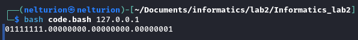

## Лабораторная работа 2

*Отчет по Лабораторной работе №1*

*Выполнил студент группы K3141, 1 курс Андреюк Николай Ростиславович. Номер ИСУ 475074*

### Цель работы
Научиться писать продвинутые bash-скрипты. Написать скрипт, преобразующий введенный IPv4 адрес, представленный в десятичном формате, в IPv4 адрес в двоичном формате.

### Ход работы
1. Создан файл [code.bash](./code.bash)

2. Задача была разбита на подзадачи:
    1. Записать в переменную введенный адрес
    2. Разбить адрес на октеты
    3. Перевести каждый октет в двоичную систему счисления
    4. Объединить все в одну строчку
    5. Вывести результат

3. Создан репозиторий для ЛР№2. Результат работы загружен на Github

